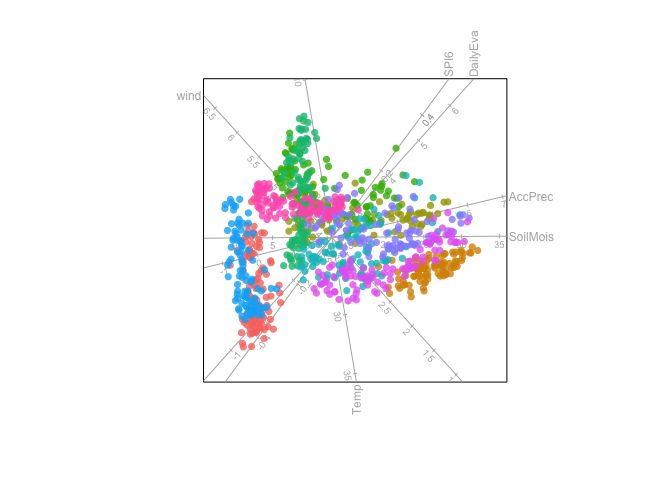
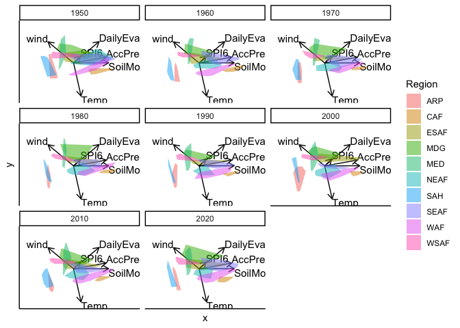
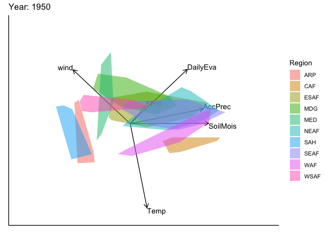
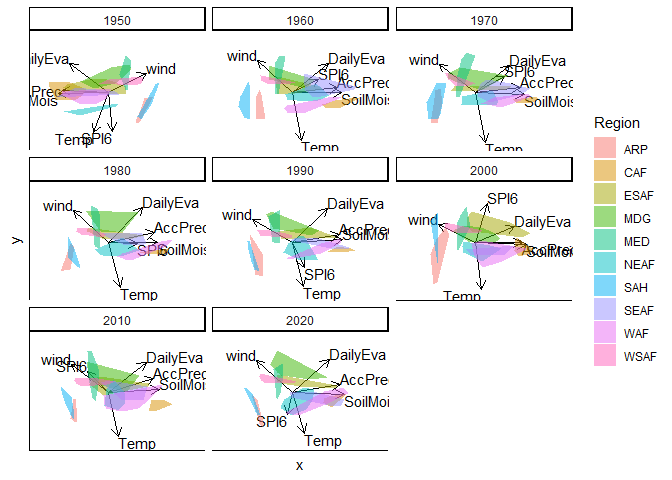
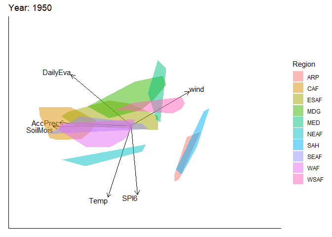
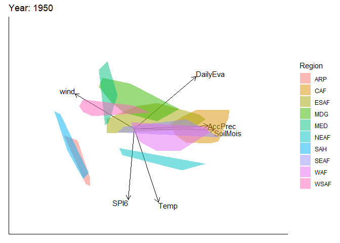
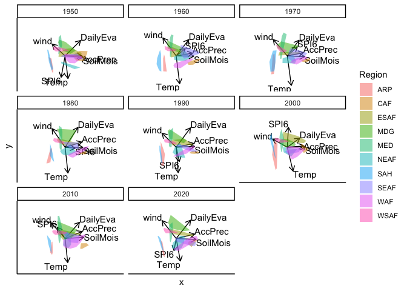
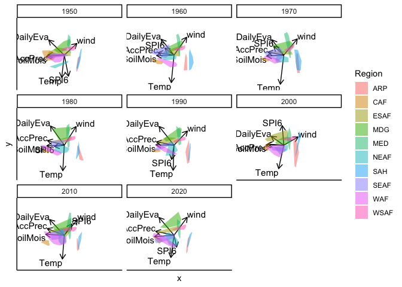
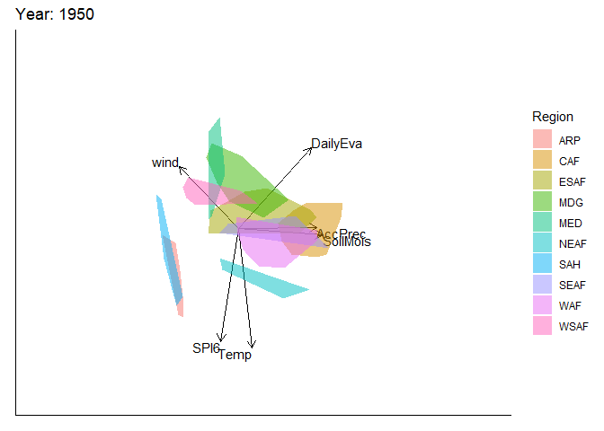
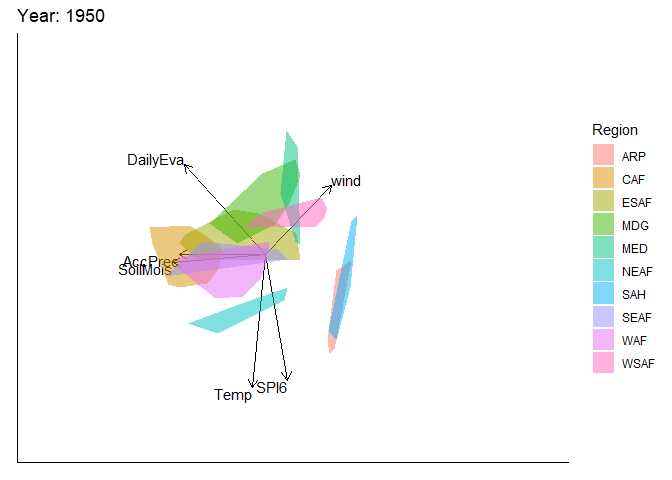

<!-- README.md is generated from README.Rmd. Please edit that file -->

# moveEZ 

<!-- badges: start -->

<!-- badges: end -->

The goal of moveEZ is to create animated biplots.

## Installation

You can install the development version of moveEZ from
[GitHub](https://github.com/) with:

``` r
# install.packages("pak")
pak::pak("MuViSU/moveEZ")
```

Consider a dataset ${\bf{X}}$ comprising $n$ observations and $p$
continuous variables, along with an additional variable representing
“time.” This time variable need not correspond to chronological time; it
could just as well represent another form of ordered index, such as
algorithmic iterations or experimental stages.

A natural approach is to construct separate biplots for each level of
the time variable, enabling the user to explore how samples and variable
relationships evolve across time. However, when the time variable
includes many levels, this quickly results in an overwhelming number of
biplots.

This package addresses that challenge by animating a single biplot
across the levels of the time variable, allowing for dynamic
visualisation of temporal or sequential changes in the data.

The animation of the biplots—currently limited to PCA biplots—is based
on two conceptual frameworks:

1.  Fixed Variable Frame `moveplot()`: A biplot is first constructed
    using the full dataset ${\bf{X}}$, and the animation is achieved by
    slicing the observations according to the “time” variable. In this
    approach, the variable axes remain fixed, and only the sample points
    are animated over time.

2.  Dynamic Frame `moveplot2()` and `moveplot3()`: Separate biplots are
    constructed for each time slice of the data. Both the sample points
    and variable axes evolve over time, resulting in a fully dynamic
    animation that reflects temporal changes in the underlying data
    structure. The differences between these functions are highlighted
    in the subsequent sections.

To illustrate the animated biplots, we use a climate dataset included in
the package. This dataset, Africa_climate, contains climate measurements
from 10 African regions over time:

``` r
library(moveEZ)
data("Africa_climate")
tibble::tibble(Africa_climate)
#> # A tibble: 960 × 9
#>    Year  Month     Region AccPrec DailyEva  Temp SoilMois  SPI6  wind
#>    <fct> <fct>     <fct>    <dbl>    <dbl> <dbl>    <dbl> <dbl> <dbl>
#>  1 1950  January   ARP      0.177  0.0316   14.8    2.75  1.62   4.07
#>  2 1950  February  ARP      0.208 -0.0249   15.4    2.22  1.32   4.24
#>  3 1950  March     ARP      0.306  0.0122   20.9    2.08  0.987  4.04
#>  4 1950  April     ARP      0.196  0.00396  24.8    1.73  0.916  3.72
#>  5 1950  May       ARP      0.590 -0.0448   28.4    2.47  0.691  3.91
#>  6 1950  June      ARP      0.32  -0.00754  30.4    1.17  0.249  4.40
#>  7 1950  July      ARP      1.33   0.00184  30.8    2.00  0.673  4.93
#>  8 1950  August    ARP      1.82  -0.00944  30.5    2.67  0.937  4.45
#>  9 1950  September ARP      0.706 -0.0107   29.7    1.98  1.22   3.67
#> 10 1950  October   ARP      0.102 -0.0259   25.9    0.976 1.65   3.18
#> # ℹ 950 more rows
```

We begin by constructing a standard PCA biplot using the `biplotEZ`
package. This biplot aggregates all samples across time and colours them
according to their associated region:

``` r
library(biplotEZ)
bp <- biplot(Africa_climate, scaled = TRUE) |> 
  PCA(group.aes = Africa_climate$Region) |> 
  samples(opacity = 0.8, col = scales::hue_pal()(10)) |>
  plot()
```



# 1. Fixed Variable Frame with `moveplot()`

Using the previously created PCA biplot object `bp`, the `moveplot()`
function enables animation of the sample points over time. This function
is piped with several key arguments:

- `time.var`: Specifies the name of the variable in the dataset that
  represents the temporal or sequential dimension. In this case, the
  variable “Year” relates to the time variable.

- `group.var`: Indicates a grouping variable used for colour-coding. In
  this case, the variable “Region” relates to the group variable.

- `hulls`: A logical flag that determines whether to display individual
  sample points or to draw convex hulls around each group.

`move`: A critical argument that controls whether the biplot is
animated. If set to `TRUE`, the sample points are animated across time.
If set to `FALSE`, the function returns a faceted plot showing a static
biplot for each time level.

This design provides flexibility in exploring temporal dynamics in
multivariate data, with options for both animated and comparative static
visualisations.

## Facet: `move = FALSE`

``` r
bp |> moveplot(time.var = "Year", group.var = "Region", hulls = TRUE, move = FALSE)
```



## Animation: `move = TRUE`

``` r
# Animated Z
bp |> moveplot(time.var = "Year", group.var = "Region", hulls = TRUE, move = TRUE)
```



# 2. Dynamic Frame `moveplot2()`

The `moveplot2()` function extends the animation to both the sample
points and the variable axes. Unlike `moveplot()`, which keeps the
variable axes fixed, `moveplot2()` constructs a separate biplot for each
time slice, allowing both components to evolve over time. The function
shares the same arguments as `moveplot()`, with the `move` argument
determining whether the animation is shown or presented as static facets
for samples and variables.

## Facet: `move = FALSE`

``` r
bp |> moveplot2(time.var = "Year", group.var = "Region", hulls = TRUE, move = FALSE)
```



When `move` is `FALSE`, a faceted plot is returned, showing the biplot
at each time point. Here, both the sample coordinates and variable axes
differ across facets, reflecting temporal changes in the data structure.

## Animated: `move = TRUE`

``` r
bp |> moveplot2(time.var = "Year", group.var = "Region", hulls = TRUE, move = TRUE)
```



Setting `move` to TRUE produces an animated biplot in which both the
samples and variables transition across time, offering a dynamic view of
structural shifts in the multivariate space.

Notice that in both the faceted and animated biplots, there is a
noticeable discontinuity in the transition from the year 1950 to 1960.
From 1960 onwards, however, the biplots appear well-aligned. To address
such inconsistencies, the \``moveplot2()` function provides two
additional arguments — `align.time` and `reflect` — which enable
alignment and optional axis reflections of the biplots at specified time
points, resulting in smoother and more coherent animations.

## Animated aligned

``` r
bp |> moveplot2(time.var = "Year", group.var = "Region", hulls = TRUE, move = TRUE,
                align.time = "1950", reflect = "x")
```



In the example above, we align the biplot at the 1950 time point and
apply a reflection about the x-axis. Available options include:

- “x” – Reflect about the x-axis

- “y” – Reflect about the y-axis

- “xy” – Reflect about both axes

And of course, both `align.time` and `reflect` can be vectors when
alignment is needed at multiple time points. Each entry in `reflect`
corresponds to a time point in `align.time`, allowing fine-grained
control over the alignment and orientation of biplots across the
animation sequence.

# 3. Dynamic frame with alignment to a `target` with `moveplot3()`

This function shares the same arguments as `moveplot()` and
`moveplot2()`, with the addition of the `target` argument. `moveplot3()`
utilises Generalised Orthogonal Procrustes Analysis (GPA) to align
sample points and variable axes to either a specified target (for
example: same measurements at a different time point) or to a centroid
coordinate matrix representing all sample points and axes across time
slices (`target = NULL`). GPA is applied by using the `GPAbin` package
and makes use of admissible transformations (translation, scaling,
rotation and reflection) to optimally align configurations, while
preserving the distances between coordinates. As with `moveplot2()` the
`move` argument determines whether the animations of changing sample
points and variables axes are shown or presented as static facets.

To illustrate the use of a fixed target, we use the year 1989 from the
`Africa_climate` data set, which consists of the same variables and
number of observations:

``` r
data("Africa_climate_target")
tibble::tibble(Africa_climate_target)
#> # A tibble: 120 × 9
#>    Year  Month     Region AccPrec DailyEva  Temp SoilMois     SPI6  wind
#>    <fct> <chr>     <chr>    <dbl>    <dbl> <dbl>    <dbl>    <dbl> <dbl>
#>  1 1989  January   ARP     0.0740 -0.00416  14.9    1.11  -1.08     4.06
#>  2 1989  February  ARP     0.235  -0.00161  17.3    1.55  -0.817    4.19
#>  3 1989  March     ARP     0.815  -0.0220   21.5    2.70   0.00329  4.12
#>  4 1989  April     ARP     0.495   0.0508   25.0    2.90   0.226    3.48
#>  5 1989  May       ARP     0.0411 -0.0130   30.1    1.08   0.306    3.96
#>  6 1989  June      ARP     0.0693 -0.0234   31.6    0.633  0.261    4.33
#>  7 1989  July      ARP     0.0833 -0.0164   33.1    0.606  0.527    4.36
#>  8 1989  August    ARP     0.137  -0.0209   32.6    0.685  0.575    4.05
#>  9 1989  September ARP     0.102  -0.0246   30.1    0.656  0.0360   3.56
#> 10 1989  October   ARP     0.0330 -0.0549   26.5    0.449 -0.919    3.45
#> # ℹ 110 more rows
```

## Facet: `move = FALSE` and `target = NULL`

``` r
bp |> moveplot3(time.var = "Year", group.var = "Region", hulls = TRUE, move = FALSE,
                target = NULL)
```



The separate biplots per `time.var` are transformed and aligned to the
centroid coordinate matrix of all observed sample points and axes
variables.

## Facet: `move = FALSE` and `target = Africa_climate_target`

``` r
bp |> moveplot3(time.var = "Year", group.var = "Region", hulls = TRUE, move = FALSE, 
                target = Africa_climate_target)
```



Now, the separate biplots per `time.var` are transformed and aligned to
the sample points and axes variables of the 1989 `Africa_climate`
dataset. **Take note**: the target biplot is not shown. This example
showcases the difference between each the observations and variables for
each year in `Africa_climate` compared to 1989.

## Animated: `move = TRUE` and `target = NULL`

``` r
bp |> moveplot3(time.var = "Year", group.var = "Region", hulls = TRUE, move = TRUE, 
                target = NULL)
```



Here the animated view of the biplots over time are illustrated after
aligning the visualisation to the centroid configuration.

## Animated: `move = TRUE` and `target = Africa_climate_target`

``` r
bp |> moveplot3(time.var = "Year", group.var = "Region", hulls = TRUE, move = TRUE, 
                target = Africa_climate_target)
```



Finally, the animated biplots illustrate the transformations towards a
specified target dataset. Again, the focus is on the movement that
changes between the variables and sample representation as the target is
set to a specific year compared to the movement observed in the previous
example where `target = NULL`. Therefore, these animations expose the
*jumps* that occur from 1989 to each of the years in `Africa_climate`
from 1950 to 2020 (in increments of 10 years).

# Still to Come!

We are actively working to develop and enhance the dynamic plotting
capabilities of these functions to expose and detect changes in
observations and variables over time.

Stay tuned for updates!
