# moveEZ

## Overview

`moveEZ` extends the `biplotEZ` package (Lubbe et al. 2024) to animate
PCA biplots across the ordered levels of a categorical variable,
referred to throughout as the **time variable**. Rather than producing a
separate static biplot per level, which fragments sequential information
and makes gradual structural change difficult to perceive, `moveEZ`
renders transitions between levels as a continuous animation.

The package provides three animation functions of increasing
methodological complexity:

- [`moveplot()`](https://muvisu.github.io/moveEZ/reference/moveplot.md):
  animates sample positions against fixed variable vectors, computed
  once on the full dataset.
- [`moveplot2()`](https://muvisu.github.io/moveEZ/reference/moveplot2.md):
  animates both sample positions and variable vectors, computed
  separately per time slice, with optional manual alignment.
- [`moveplot3()`](https://muvisu.github.io/moveEZ/reference/moveplot3.md):
  extends
  [`moveplot2()`](https://muvisu.github.io/moveEZ/reference/moveplot2.md)
  with automated alignment via Generalised Procrustes Analysis (GPA)
  (Gower and Dijksterhuis 2004).

All three functions support both animated output (`move = TRUE`) and
static faceted output (`move = FALSE`), the latter being useful for
publication figures or detailed inspection of individual time slices.

For a full methodological treatment, including the theoretical
motivation for each framework and a discussion of sign indeterminacy in
sequential PCA, refer to the accompanying paper.

## Data

Throughout this vignette we use the `Africa_climate` dataset included in
`moveEZ`. This dataset contains climate measurements for ten African
regions derived from the ERA5 reanalysis (Hersbach et al. 2023), with
IPCC-defined reference regions (Iturbide et al. 2020) as the grouping
variable. Measurements span from 1950 to 2020 in ten-year increments,
with twelve monthly observations per region per year. The six continuous
variables are described below:

| Variable | Unit | Description |
|----|----|----|
| Accumulated Precipitation (AP) | m/day | Total daily precipitation |
| Daily Evaporation (DE) | m/day | Net daily evaporation |
| Temperature (Temp) | °C | Mean daily surface temperature |
| Soil Moisture (SM) | m³/m³ | Volumetric water content of upper soil layer |
| Standardised Precipitation Index (SPI6) | Dimensionless | 6-month precipitation anomaly index |
| Wind Speed (Wind) | m/s | Mean daily wind speed at 10m |

``` r

data("Africa_climate")
tibble::tibble(Africa_climate)
#> # A tibble: 960 × 9
#>    Year  Month     Region AccPrec DailyEva  Temp SoilMois  SPI6  wind
#>    <fct> <fct>     <fct>    <dbl>    <dbl> <dbl>    <dbl> <dbl> <dbl>
#>  1 1950  January   ARP      0.177  0.0316   14.8    2.75  1.62   4.07
#>  2 1950  February  ARP      0.208 -0.0249   15.4    2.22  1.32   4.24
#>  3 1950  March     ARP      0.306  0.0122   20.9    2.08  0.987  4.04
#>  4 1950  April     ARP      0.196  0.00396  24.8    1.73  0.916  3.72
#>  5 1950  May       ARP      0.590 -0.0448   28.4    2.47  0.691  3.91
#>  6 1950  June      ARP      0.32  -0.00754  30.4    1.17  0.249  4.40
#>  7 1950  July      ARP      1.33   0.00184  30.8    2.00  0.673  4.93
#>  8 1950  August    ARP      1.82  -0.00944  30.5    2.67  0.937  4.45
#>  9 1950  September ARP      0.706 -0.0107   29.7    1.98  1.22   3.67
#> 10 1950  October   ARP      0.102 -0.0259   25.9    0.976 1.65   3.18
#> # ℹ 950 more rows
```

All examples in this vignette use a PCA biplot constructed on the full
`Africa_climate` dataset as the base object, passed to each `moveplot`
function via the pipe operator:

``` r

bp <- biplot(Africa_climate, scaled = TRUE) |>
  PCA(group.aes = Africa_climate$Region) |>
  samples(opacity = 0.8, col = scales::hue_pal()(10)) |>
  plot()
```

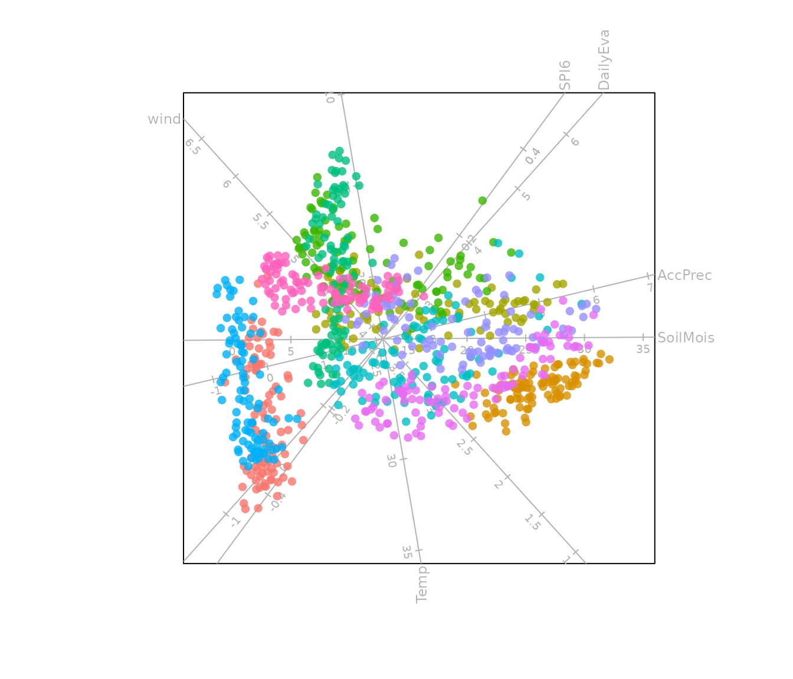

## Fixed Variable Frame: `moveplot()`

[`moveplot()`](https://muvisu.github.io/moveEZ/reference/moveplot.md)
computes a single PCA decomposition on the full dataset. The variable
vectors remain fixed throughout the animation, providing a stable
reference frame. Only the sample positions, sliced according to the
levels of the time variable, are animated sequentially. This approach is
most appropriate when the underlying variance–covariance structure can
be assumed stable across time, and is the only viable option when there
is a single observation per group per time level.

The key arguments are:

- `time.var`: the name of the ordered categorical variable defining the
  sequential structure (e.g. `"Year"`).
- `group.var`: the name of the grouping variable, used for colour-coding
  (e.g. `"Region"`).
- `hulls`: logical; when `TRUE` convex hulls summarise group spread at
  each time level; when `FALSE` individual sample points are displayed.
  Hulls require at least three observations per group per time level —
  if fewer exist, points are plotted automatically.
- `move`: logical; `TRUE` produces an animation, `FALSE` produces a
  static faceted display.
- `shadow`: logical; available only when `hulls = FALSE`. When `TRUE`,
  faded traces of previous sample positions are retained in the
  animation, conveying the direction and speed of movement across time.
- `scale.var`: numeric multiplier applied to variable vectors to improve
  visibility.

### Static faceted display

``` r

bp |> moveplot(time.var = "Year", group.var = "Region",
               hulls = TRUE, move = FALSE)
```

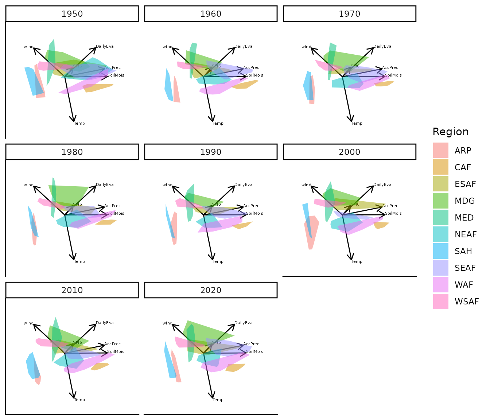

    #> Object of class biplot, based on 960 samples and 9 variables.
    #> 6 numeric variables.
    #> 3 categorical variables.

### Animated display


The animation reveals how the regional climate configurations shift
relative to the fixed variable vectors across decades. Regions that move
in the direction of a variable vector are increasing on that variable
over time; regions moving against the vector are decreasing.

## Dynamic Frame: `moveplot2()`

[`moveplot2()`](https://muvisu.github.io/moveEZ/reference/moveplot2.md)
computes a separate PCA decomposition for each time slice, allowing both
sample positions and variable vectors to evolve across levels. This
provides a more faithful depiction of time-varying variance–covariance
structures but introduces a practical complication: eigenvectors are
determined only up to a sign change, meaning that consecutive time
slices may produce biplots that are reflections of one another. This
sign indeterminacy is mathematically inconsequential but visually
disruptive.

Two additional arguments address this:

- `align.time`: a vector of time levels at which alignment should be
  applied.
- `reflect`: specifies the axis of reflection — `"x"`, `"y"`, or `"xy"`
  — with each entry corresponding to a level in `align.time`. Both
  arguments accept vectors when alignment is needed at multiple time
  levels.

### Static faceted display (unaligned)

``` r

bp1 <- bp |> moveplot2(time.var = "Year", group.var = "Region",
                hulls = TRUE, move = FALSE)
```

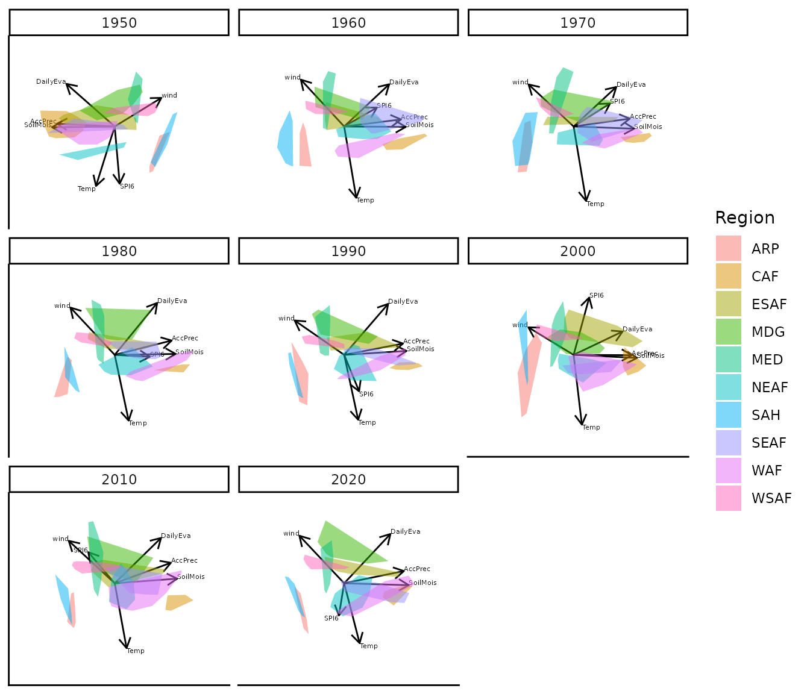

Note the discontinuity between 1950 and 1960 - the variable vectors and
sample configuration are reflected about the x-axis. This is a sign
indeterminacy artifact, not a genuine structural change.

### Static faceted display (aligned)

``` r

bp2 <- bp |> moveplot2(time.var = "Year", group.var = "Region",
                hulls = TRUE, move = FALSE,
                align.time = "1950", reflect = "x")
```

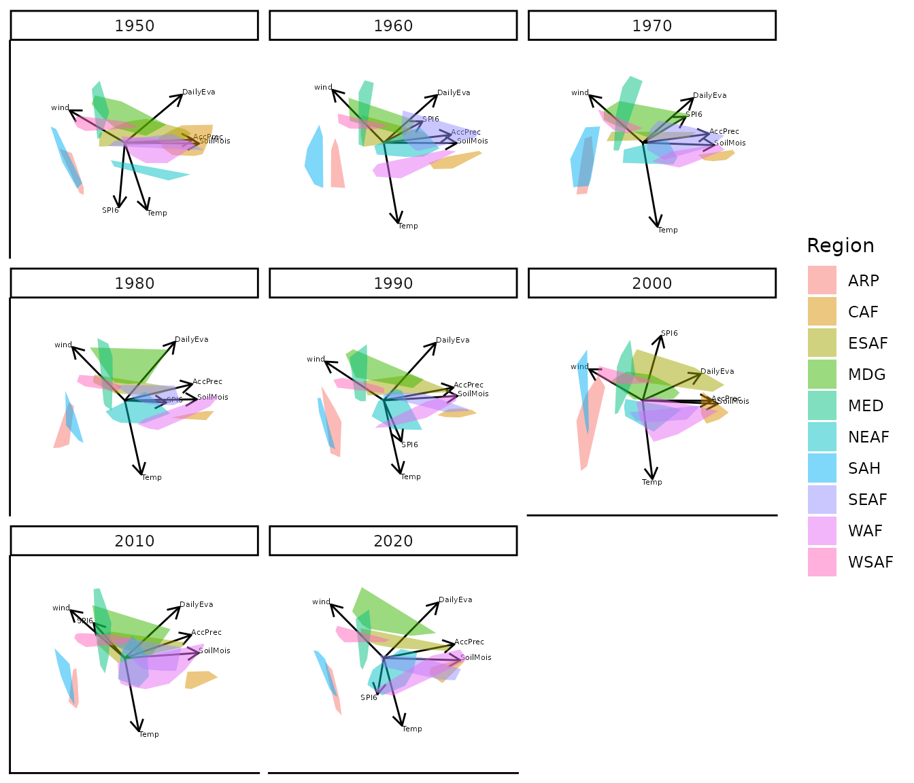

Applying a reflection about the x-axis at 1950 restores visual
continuity across the sequence of biplots.

## Automated Alignment: `moveplot3()`

[`moveplot3()`](https://muvisu.github.io/moveEZ/reference/moveplot3.md)
automates the alignment of sequential biplots using GPA (Gower and
Dijksterhuis 2004), implemented via the `GPAbin` package
(Nienkemper-Swanepoel et al. 2023). GPA iteratively applies admissible
transformations: translation, reflection, rotation, and scaling, to
minimise the sum of squared distances between each time slice and a
target configuration, without requiring the user to manually identify
discontinuities.

The `target` argument controls what the time slices are aligned to:

- `target = NULL`: aligns all time slices to their average (consensus)
  configuration.
- `target = <dataset>`: aligns all time slices to a user-supplied
  reference dataset containing measurements on the same variables.

The `Africa_climate_target` dataset included in `moveEZ` provides 1989
measurements on the same variables as `Africa_climate`, and is used here
as an external reference.

### Consensus target (`target = NULL`)

#### Static faceted display

``` r

bp |> moveplot3(time.var = "Year", group.var = "Region",
                hulls = TRUE, move = FALSE, target = NULL)
```

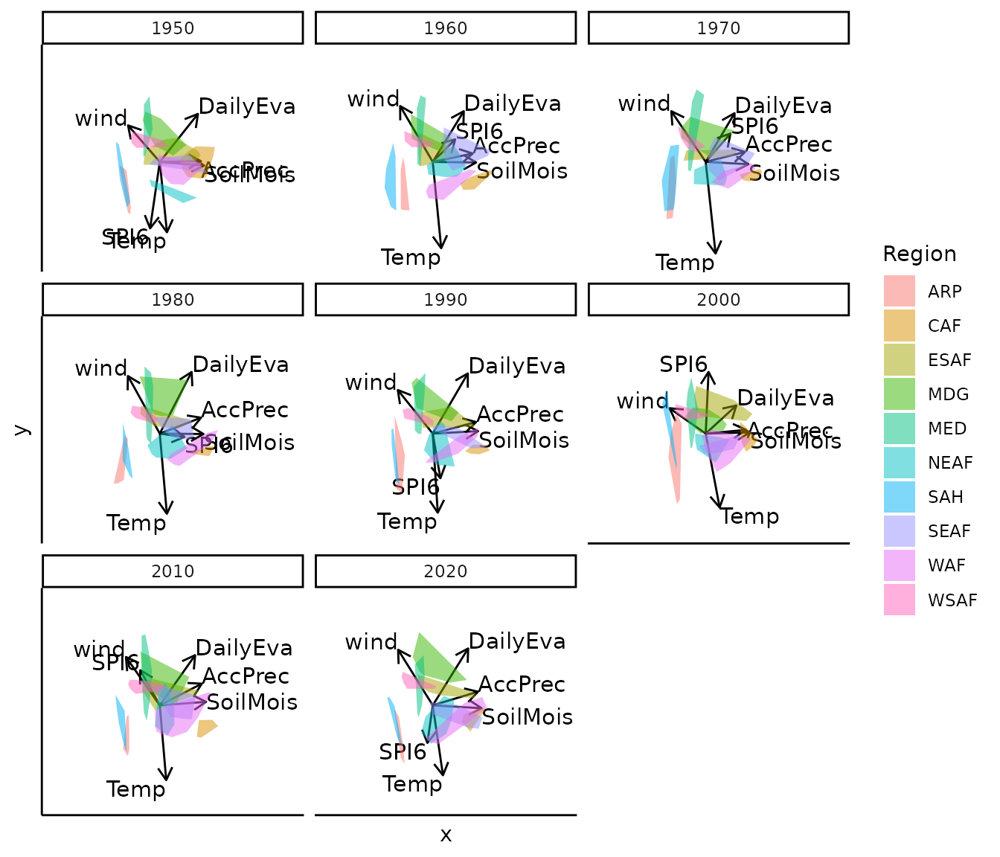

    #> Object of class biplot, based on 960 samples and 9 variables.
    #> 6 numeric variables.
    #> 3 categorical variables.

All time slices are aligned to the average configuration across years,
producing a consistently oriented sequence of biplots without manual
intervention.

### User-supplied target (`target = Africa_climate_target`)

``` r

data("Africa_climate_target")
tibble::tibble(Africa_climate_target)
#> # A tibble: 120 × 9
#>    Year  Month     Region AccPrec DailyEva  Temp SoilMois     SPI6  wind
#>    <fct> <chr>     <chr>    <dbl>    <dbl> <dbl>    <dbl>    <dbl> <dbl>
#>  1 1989  January   ARP     0.0740 -0.00416  14.9    1.11  -1.08     4.06
#>  2 1989  February  ARP     0.235  -0.00161  17.3    1.55  -0.817    4.19
#>  3 1989  March     ARP     0.815  -0.0220   21.5    2.70   0.00329  4.12
#>  4 1989  April     ARP     0.495   0.0508   25.0    2.90   0.226    3.48
#>  5 1989  May       ARP     0.0411 -0.0130   30.1    1.08   0.306    3.96
#>  6 1989  June      ARP     0.0693 -0.0234   31.6    0.633  0.261    4.33
#>  7 1989  July      ARP     0.0833 -0.0164   33.1    0.606  0.527    4.36
#>  8 1989  August    ARP     0.137  -0.0209   32.6    0.685  0.575    4.05
#>  9 1989  September ARP     0.102  -0.0246   30.1    0.656  0.0360   3.56
#> 10 1989  October   ARP     0.0330 -0.0549   26.5    0.449 -0.919    3.45
#> # ℹ 110 more rows
```

#### Static faceted display

``` r

bp |> moveplot3(time.var = "Year", group.var = "Region",
                hulls = TRUE, move = FALSE,
                target = Africa_climate_target)
```

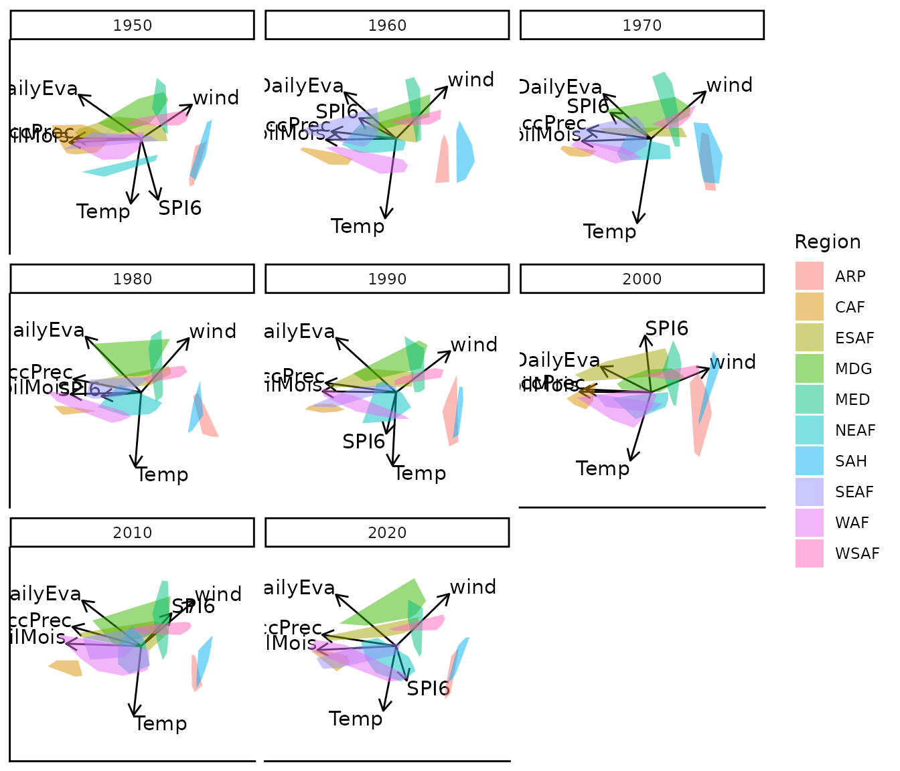

    #> Object of class biplot, based on 960 samples and 9 variables.
    #> 6 numeric variables.
    #> 3 categorical variables.

Each time slice is aligned to the 1989 reference configuration, exposing
the structural differences between 1989 and each decade from 1950 to
2020. Note that the target biplot itself is not shown in this display,
it serves only as the alignment reference. To visualise the target
configuration separately, pass it to
[`moveplot()`](https://muvisu.github.io/moveEZ/reference/moveplot.md)
directly:

``` r

viz_1989 <- Africa_climate_target |>
  dplyr::mutate(
    Target = as.factor(rep("1989", nrow(Africa_climate_target))),
    Region = as.factor(Region)
  )

bp_1989 <- biplot(viz_1989, scaled = TRUE) |>
  PCA(group.aes = viz_1989$Region)

bp_1989 |> moveplot(time.var = "Target", group.var = "Region",
                    hulls = TRUE, move = FALSE)
```

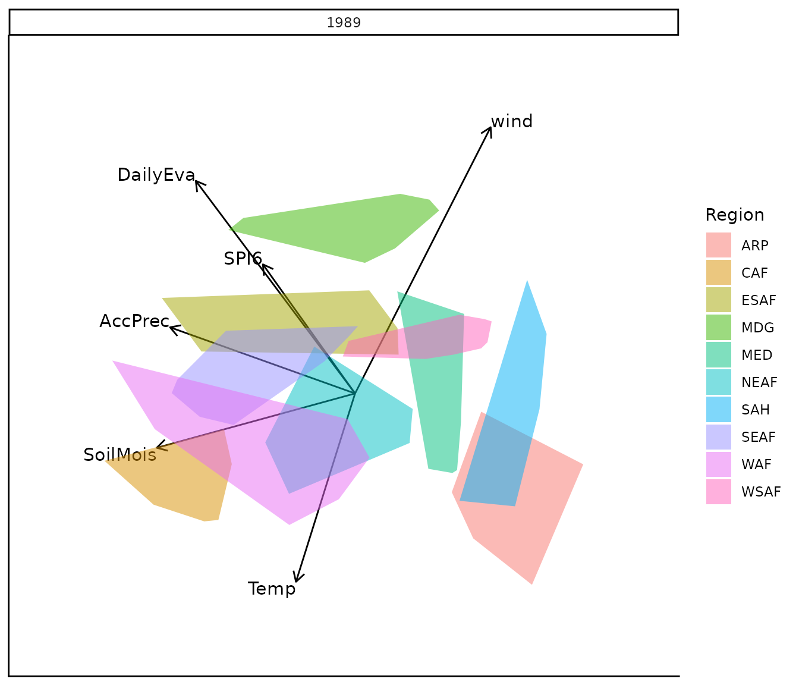

    #> Object of class biplot, based on 120 samples and 10 variables.
    #> 6 numeric variables.
    #> 4 categorical variables.

## Evaluation

The
[`evaluation()`](https://muvisu.github.io/moveEZ/reference/evaluation.md)
function quantifies the magnitude of structural change between each time
slice and the target configuration specified in
[`moveplot3()`](https://muvisu.github.io/moveEZ/reference/moveplot3.md).
It provides five measures based on orthogonal Procrustes analysis, in
two categories:

**Fit measures** (values closer to their optimal indicate better
similarity):

- **PS** (Procrustes Statistic): optimal value is 0.
- **CC** (Congruence Coefficient): optimal value is 1.

**Bias measures** (lower values indicate less systematic distortion):

- **AMB** (Absolute Mean Bias)
- **MB** (Mean Bias): a value near zero indicates no systematic
  directional shift.
- **RMSB** (Root Mean Squared Bias)

``` r

results <- bp |>
  moveplot3(time.var = "Year", group.var = "Region",
            hulls = TRUE, move = FALSE, target = NULL) |>
  evaluation()
```

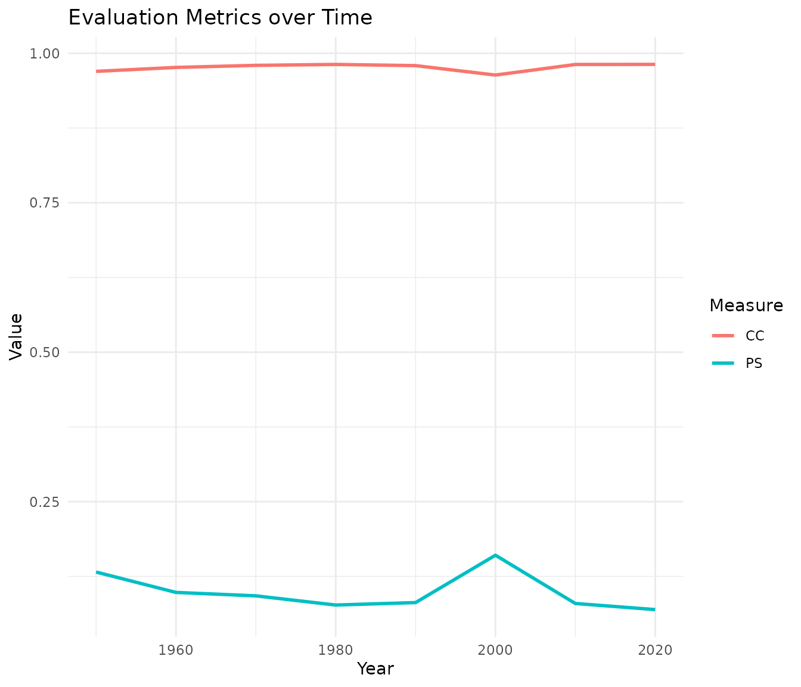

### Numerical measures

``` r

results$eval.list
#> [[1]]
#>      Target vs. 1950
#> PS            0.1323
#> CC            0.9697
#> AMB           1.2717
#> MB            0.0000
#> RMSB          1.8506
#> 
#> [[2]]
#>      Target vs. 1960
#> PS            0.0982
#> CC            0.9763
#> AMB           0.4414
#> MB            0.0000
#> RMSB          0.5779
#> 
#> [[3]]
#>      Target vs. 1970
#> PS            0.0925
#> CC            0.9798
#> AMB           0.4373
#> MB            0.0000
#> RMSB          0.5701
#> 
#> [[4]]
#>      Target vs. 1980
#> PS            0.0771
#> CC            0.9813
#> AMB           0.3903
#> MB            0.0000
#> RMSB          0.5501
#> 
#> [[5]]
#>      Target vs. 1990
#> PS            0.0812
#> CC            0.9793
#> AMB           0.4177
#> MB            0.0000
#> RMSB          0.5446
#> 
#> [[6]]
#>      Target vs. 2000
#> PS            0.1604
#> CC            0.9636
#> AMB           0.5263
#> MB            0.0000
#> RMSB          0.6564
#> 
#> [[7]]
#>      Target vs. 2010
#> PS            0.0797
#> CC            0.9813
#> AMB           0.4337
#> MB            0.0000
#> RMSB          0.5428
#> 
#> [[8]]
#>      Target vs. 2020
#> PS            0.0695
#> CC            0.9814
#> AMB           0.3914
#> MB            0.0000
#> RMSB          0.5069
```

### Fit measures over time

``` r

results$fit.plot
```

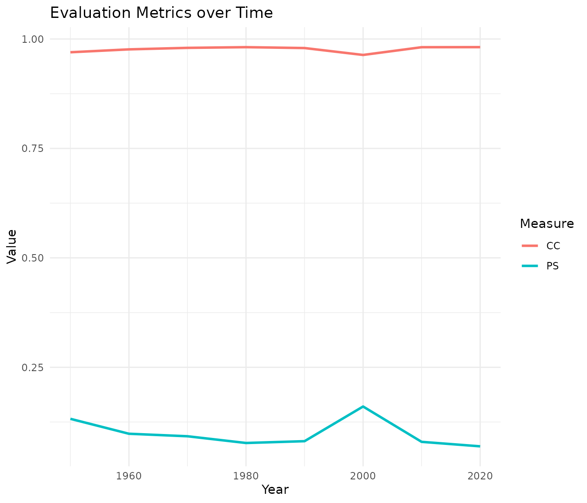

The biplot for 2000 shows a notably lower CC and higher PS relative to
other years, indicating a structural departure from the consensus
configuration that warrants closer investigation.

### Bias measures over time

``` r

results$bias.plot
```

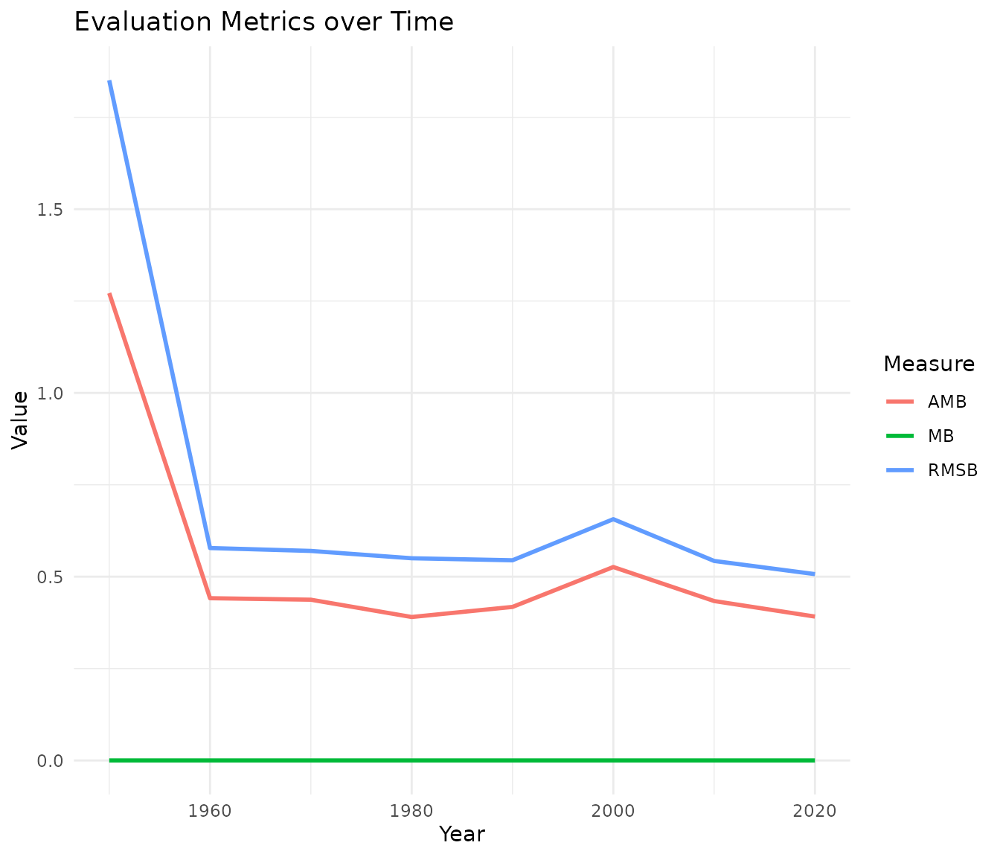

The initial bias at 1950 is high but decreases and stabilises from 1960,
with an increase in AMB and RMSB at 2000 consistent with the fit
measures. The MB remains close to zero throughout, confirming no
systematic directional bias in the alignment.

## Additional Examples

### Alternative use of `time.var`

The group variable can be specified as the time variable to produce a
faceted display in which each panel shows a single group rather than a
single time level. This can be useful when group-level patterns are
difficult to distinguish in the standard faceted display, where all
groups appear together in each panel.

``` r

bp |> moveplot(time.var = "Region", group.var = "Region",
               hulls = FALSE, move = FALSE)
```

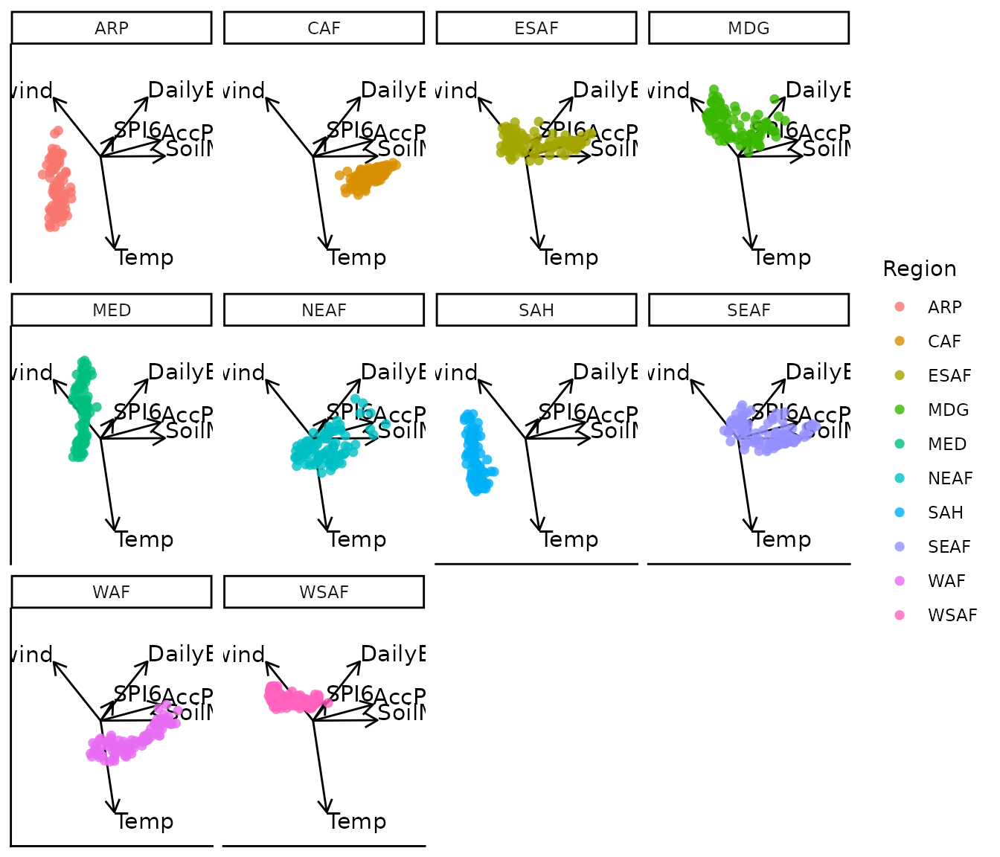

    #> Object of class biplot, based on 960 samples and 9 variables.
    #> 6 numeric variables.
    #> 3 categorical variables.

### Customising aesthetics

`moveEZ` inherits its core biplot construction from `biplotEZ`, and
aesthetic customisation, such as point colours, plotting characters, and
axis label sizes — should be specified in the `biplotEZ` biplot object
before passing it to any `moveplot` function. If no aesthetic changes
are made to
[`biplotEZ::samples()`](https://rdrr.io/pkg/biplotEZ/man/samples.html)
or [`biplotEZ::axes()`](https://rdrr.io/pkg/biplotEZ/man/axes.html), the
default `moveEZ` aesthetics are applied automatically.

One important conversion to be aware of: `biplotEZ` uses R base graphics
sizing, while `moveEZ` renders using `ggplot2`. Text size is therefore
automatically rescaled — for example, `biplotEZ::axes(label.cex = 1)`
produces a `ggplot2` text size of 2 (i.e. `geom_text(size = 2)`). Adjust
`label.cex` accordingly to achieve the desired label size in the final
animation.

#### Custom colour palette and axis label size

``` r

bp_custom <- biplotEZ::biplot(Africa_climate, scaled = TRUE,
                               group.aes = Africa_climate$Region) |>
  biplotEZ::PCA() |>
  biplotEZ::samples(col = RColorBrewer::brewer.pal(10, "Paired")) |>
  biplotEZ::axes(label.cex = 1.2)

bp_custom |> moveplot(time.var = "Year", group.var = "Region",
                      hulls = TRUE, move = FALSE)
```

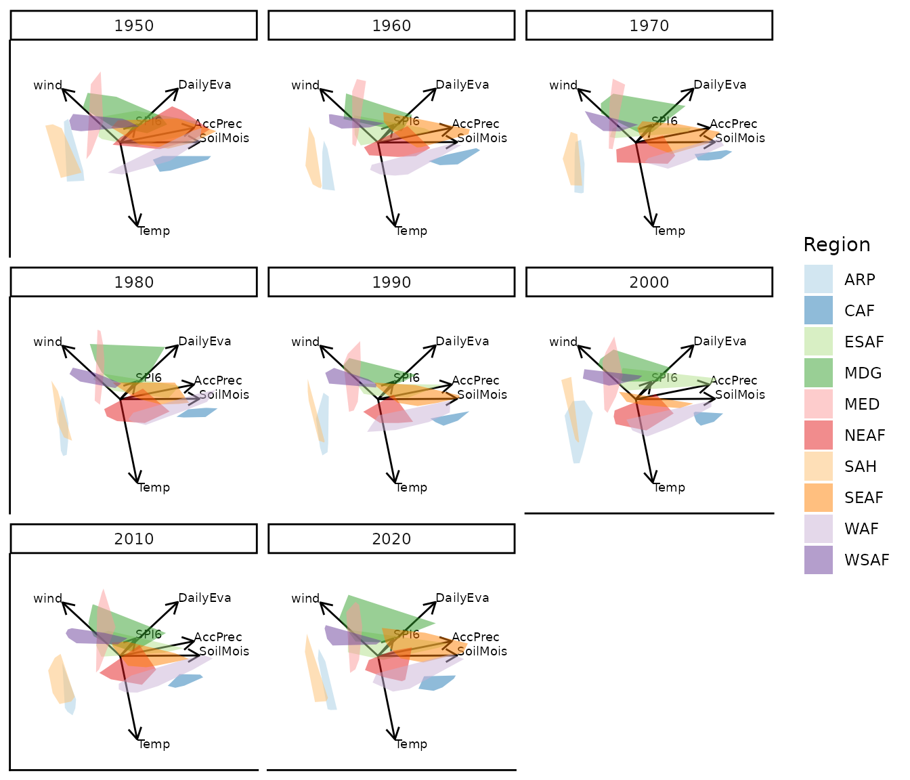

    #> Object of class biplot, based on 960 samples and 9 variables.
    #> 6 numeric variables.
    #> 3 categorical variables.

#### Custom plotting characters and opacity

``` r

bp_pch <- biplotEZ::biplot(Africa_climate, scaled = TRUE,
                            group.aes = Africa_climate$Region) |>
  biplotEZ::PCA() |>
  biplotEZ::samples(pch = c(22, 21, 24, 23), opacity = 0.4)

bp_pch |> moveplot(time.var = "Year", group.var = "Region",
                   hulls = FALSE, move = FALSE)
```

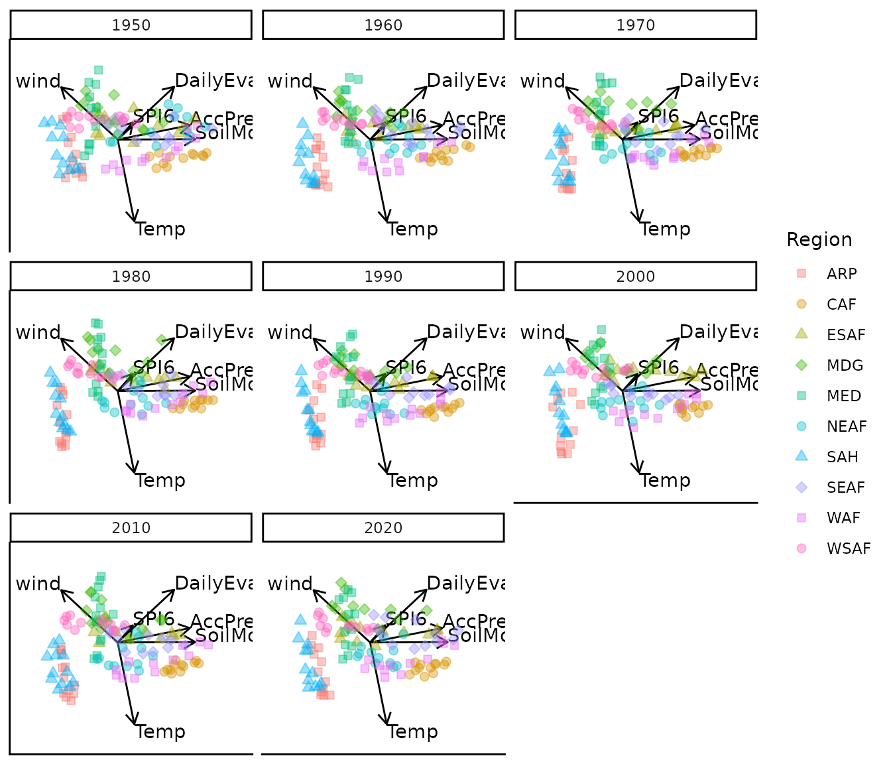

    #> Object of class biplot, based on 960 samples and 9 variables.
    #> 6 numeric variables.
    #> 3 categorical variables.

Note that `pch` values cycle across the ten region groups - specify ten
values to assign a unique character to each region.

## References

Gower, J. C., and G. B. Dijksterhuis. 2004. *Procrustes Problems*. Book.
Oxford University Press.

Hersbach, Hans, Bill Bell, Paul Berrisford, et al. 2023. *ERA5 hourly
data on single levels from 1940 to present*. Copernicus Climate Change
Service (C3S) Climate Data Store (CDS).
<https://doi.org/10.24381/cds.adbb2d47>.

Iturbide, M., J. M. Gutiérrez, L. M. Alves, et al. 2020. “An Update of
IPCC Climate Reference Regions for Subcontinental Analysis of Climate
Model Data: Definition and Aggregated Datasets.” *Earth System Science
Data* 12 (4): 2959–70. <https://doi.org/10.5194/essd-12-2959-2020>.

Lubbe, Sugnet, Niël le Roux, Johané Nienkemper-Swanepoel, et al. 2024.
*biplotEZ: EZ-to-Use Biplots*.
<https://doi.org/10.32614/CRAN.package.biplotEZ>.

Nienkemper-Swanepoel, J., N. J. le Roux, and S. Gardner-Lubbe. 2023.
“GPAbin: Unifying Visualizations of Multiple Imputations for Missing
Values.” *Communications in Statistics - Simulation and Computation* 52
(6): 2666–85. <https://doi.org/10.1080/03610918.2021.1914089>.
