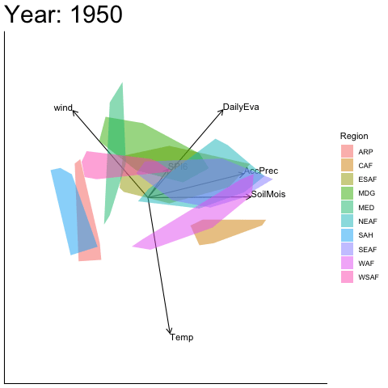

```{r, include = FALSE}
knitr::opts_chunk$set(
  fig.height = 6, fig.width = 7,
  collapse = TRUE,
  comment = "#>"
)
```

```{r setup, include=FALSE}
library(moveEZ)
library(biplotEZ)
library(tibble)
library(scales)
library(gganimate)
library(RColorBrewer)
```

# Overview

`moveEZ` extends the `biplotEZ` package [@biplotEZ] to animate PCA biplots
across the ordered levels of a categorical variable, referred to throughout
as the **time variable**. Rather than producing a separate static biplot per
level, which fragments sequential information and makes gradual structural
change difficult to perceive, `moveEZ` renders transitions between levels as
a continuous animation.

The package provides three animation functions of increasing methodological
complexity:

- `moveplot()`: animates sample positions against fixed variable vectors,
  computed once on the full dataset.
- `moveplot2()`: animates both sample positions and variable vectors,
  computed separately per time slice, with optional manual alignment.
- `moveplot3()`: extends `moveplot2()` with automated alignment via
  Generalised Procrustes Analysis (GPA) [@Proc].

All three functions support both animated output (`move = TRUE`) and static
faceted output (`move = FALSE`), the latter being useful for publication
figures or detailed inspection of individual time slices.

For a full methodological treatment, including the theoretical motivation for
each framework and a discussion of sign indeterminacy in sequential PCA, refer
to the accompanying paper.

# Data

Throughout this vignette we use the `Africa_climate` dataset included in
`moveEZ`. This dataset contains climate measurements for ten African regions
derived from the ERA5 reanalysis [@ERA5], with IPCC-defined reference regions
[@IPCC] as the grouping variable. Measurements span from 1950 to 2020 in
ten-year increments, with twelve monthly observations per region per year.
The six continuous variables are described below:

| Variable | Unit | Description |
|---|---|---|
| Accumulated Precipitation (AP) | m/day | Total daily precipitation |
| Daily Evaporation (DE) | m/day | Net daily evaporation |
| Temperature (Temp) | °C | Mean daily surface temperature |
| Soil Moisture (SM) | m³/m³ | Volumetric water content of upper soil layer |
| Standardised Precipitation Index (SPI6) | Dimensionless | 6-month precipitation anomaly index |
| Wind Speed (Wind) | m/s | Mean daily wind speed at 10m |


```{r}
data("Africa_climate")
tibble::tibble(Africa_climate)
```

All examples in this vignette use a PCA biplot constructed on the full
`Africa_climate` dataset as the base object, passed to each `moveplot`
function via the pipe operator:

```{r, message=FALSE}
bp <- biplot(Africa_climate, scaled = TRUE) |>
  PCA(group.aes = Africa_climate$Region) |>
  samples(opacity = 0.8, col = scales::hue_pal()(10)) |>
  plot()
```

# Fixed Variable Frame: `moveplot()`

`moveplot()` computes a single PCA decomposition on the full dataset. The
variable vectors remain fixed throughout the animation, providing a stable
reference frame. Only the sample positions, sliced according to the levels
of the time variable, are animated sequentially. This approach is most
appropriate when the underlying variance–covariance structure can be assumed
stable across time, and is the only viable option when there is a single
observation per group per time level.

The key arguments are:

- `time.var`: the name of the ordered categorical variable defining the
  sequential structure (e.g. `"Year"`).
- `group.var`: the name of the grouping variable, used for colour-coding
  (e.g. `"Region"`).
- `hulls`: logical; when `TRUE` convex hulls summarise group spread at each
  time level; when `FALSE` individual sample points are displayed. Hulls
  require at least three observations per group per time level — if fewer
  exist, points are plotted automatically.
- `move`: logical; `TRUE` produces an animation, `FALSE` produces a static
  faceted display.
- `shadow`: logical; available only when `hulls = FALSE`. When `TRUE`, faded
  traces of previous sample positions are retained in the animation,
  conveying the direction and speed of movement across time.
- `scale.var`: numeric multiplier applied to variable vectors to improve
  visibility.

## Static faceted display

```{r, warning=FALSE}
bp |> moveplot(time.var = "Year", group.var = "Region",
               hulls = TRUE, move = FALSE)
```

## Animated display



```{r, echo=FALSE, eval=FALSE, warning=FALSE, message=FALSE}
anim1 <- bp |> moveplot(time.var = "Year", group.var = "Region",
                        hulls = TRUE, move = TRUE)
anim_rendered <- animate(anim1, renderer = gifski_renderer(),
                         nframes = 100, fps = 10,
                         width = 800, height = 600, res = 150)
anim_save("vignettes/anim1.gif", animation = anim_rendered)
```

The animation reveals how the regional climate configurations shift relative
to the fixed variable vectors across decades. Regions that move in the
direction of a variable vector are increasing on that variable over time;
regions moving against the vector are decreasing.

# Dynamic Frame: `moveplot2()`

`moveplot2()` computes a separate PCA decomposition for each time slice,
allowing both sample positions and variable vectors to evolve across levels.
This provides a more faithful depiction of time-varying variance–covariance
structures but introduces a practical complication: eigenvectors are
determined only up to a sign change, meaning that consecutive time slices
may produce biplots that are reflections of one another. This sign
indeterminacy is mathematically inconsequential but visually disruptive.

Two additional arguments address this:

- `align.time`: a vector of time levels at which alignment should be applied.
- `reflect`: specifies the axis of reflection — `"x"`, `"y"`, or `"xy"` —
  with each entry corresponding to a level in `align.time`. Both arguments
  accept vectors when alignment is needed at multiple time levels.

## Static faceted display (unaligned)

```{r, warning=FALSE}
bp |> moveplot2(time.var = "Year", group.var = "Region",
                hulls = TRUE, move = FALSE)
```

Note the discontinuity between 1950 and 1960 - the variable vectors and
sample configuration are reflected about the x-axis. This is a sign
indeterminacy artefact, not a genuine structural change.

## Static faceted display (aligned)

```{r, warning=FALSE}
bp |> moveplot2(time.var = "Year", group.var = "Region",
                hulls = TRUE, move = FALSE,
                align.time = "1950", reflect = "x")
```

Applying a reflection about the x-axis at 1950 restores visual continuity
across the sequence of biplots.


```{r, echo=FALSE, eval=FALSE, warning=FALSE, message=FALSE}
anim2 <- bp |> moveplot2(time.var = "Year", group.var = "Region",
                         hulls = TRUE, move = TRUE,
                         align.time = "1950", reflect = "x")
anim_rendered <- animate(anim2, renderer = gifski_renderer(),
                         nframes = 100, fps = 10,
                         width = 800, height = 600, res = 150)
anim_save("vignettes/anim2.gif", animation = anim_rendered)
```

# Automated Alignment: `moveplot3()`

`moveplot3()` automates the alignment of sequential biplots using GPA
[@Proc], implemented via the `GPAbin` package [@GPAbinart]. GPA iteratively
applies admissible transformations: translation, reflection, rotation, and
scaling, to minimise the sum of squared distances between each time slice
and a target configuration, without requiring the user to manually identify
discontinuities.

The `target` argument controls what the time slices are aligned to:

- `target = NULL`: aligns all time slices to their average (consensus)
  configuration.
- `target = <dataset>`: aligns all time slices to a user-supplied reference
  dataset containing measurements on the same variables.

The `Africa_climate_target` dataset included in `moveEZ` provides 1989
measurements on the same variables as `Africa_climate`, and is used here
as an external reference.

## Consensus target (`target = NULL`)

### Static faceted display

```{r, warning=FALSE}
bp |> moveplot3(time.var = "Year", group.var = "Region",
                hulls = TRUE, move = FALSE, target = NULL)
```

All time slices are aligned to the average configuration across years,
producing a consistently oriented sequence of biplots without manual
intervention.


```{r, echo=FALSE, eval=FALSE, warning=FALSE, message=FALSE}
anim3 <- bp |> moveplot3(time.var = "Year", group.var = "Region",
                         hulls = TRUE, move = TRUE, target = NULL)
anim_rendered <- animate(anim3, renderer = gifski_renderer(),
                         nframes = 100, fps = 10,
                         width = 800, height = 600, res = 150)
anim_save("vignettes/anim3.gif", animation = anim_rendered)
```

## User-supplied target (`target = Africa_climate_target`)

```{r}
data("Africa_climate_target")
tibble::tibble(Africa_climate_target)
```

### Static faceted display

```{r, warning=FALSE}
bp |> moveplot3(time.var = "Year", group.var = "Region",
                hulls = TRUE, move = FALSE,
                target = Africa_climate_target)
```

Each time slice is aligned to the 1989 reference configuration, exposing
the structural differences between 1989 and each decade from 1950 to 2020.
Note that the target biplot itself is not shown in this display, it serves
only as the alignment reference. To visualise the target configuration
separately, pass it to `moveplot()` directly:

```{r, warning=FALSE}
viz_1989 <- Africa_climate_target |>
  dplyr::mutate(
    Target = as.factor(rep("1989", nrow(Africa_climate_target))),
    Region = as.factor(Region)
  )

bp_1989 <- biplot(viz_1989, scaled = TRUE) |>
  PCA(group.aes = viz_1989$Region)

bp_1989 |> moveplot(time.var = "Target", group.var = "Region",
                    hulls = TRUE, move = FALSE)
```


```{r, echo=FALSE, eval=FALSE, warning=FALSE, message=FALSE}
anim4 <- bp |> moveplot3(time.var = "Year", group.var = "Region",
                         hulls = TRUE, move = TRUE,
                         target = Africa_climate_target)
anim_rendered <- animate(anim4, renderer = gifski_renderer(),
                         nframes = 100, fps = 10,
                         width = 800, height = 600, res = 150)
anim_save("vignettes/anim4.gif", animation = anim_rendered)
```

# Evaluation

The `evaluation()` function quantifies the magnitude of structural change
between each time slice and the target configuration specified in
`moveplot3()`. It provides five measures based on orthogonal Procrustes
analysis, in two categories:

**Fit measures** (values closer to their optimal indicate better similarity):

- **PS** (Procrustes Statistic): optimal value is 0.
- **CC** (Congruence Coefficient): optimal value is 1.

**Bias measures** (lower values indicate less systematic distortion):

- **AMB** (Absolute Mean Bias)
- **MB** (Mean Bias): a value near zero indicates no systematic directional
  shift.
- **RMSB** (Root Mean Squared Bias)

```{r, message=FALSE}
results <- bp |>
  moveplot3(time.var = "Year", group.var = "Region",
            hulls = TRUE, move = FALSE, target = NULL) |>
  evaluation()
```

## Numerical measures

```{r}
results$eval.list
```

## Fit measures over time

```{r, warning=FALSE}
results$fit.plot
```

The biplot for 2000 shows a notably lower CC and higher PS relative to other
years, indicating a structural departure from the consensus configuration
that warrants closer investigation.

## Bias measures over time

```{r, warning=FALSE}
results$bias.plot
```

The initial bias at 1950 is high but decreases and stabilises from 1960,
with an increase in AMB and RMSB at 2000 consistent with the fit measures.
The MB remains close to zero throughout, confirming no systematic directional
bias in the alignment.

# Additional Examples

## Alternative use of `time.var`

The group variable can be specified as the time variable to produce a faceted
display in which each panel shows a single group rather than a single time
level. This can be useful when group-level patterns are difficult to
distinguish in the standard faceted display, where all groups appear together
in each panel.

```{r, warning=FALSE}
bp |> moveplot(time.var = "Region", group.var = "Region",
               hulls = FALSE, move = FALSE)
```

## Customising aesthetics

`moveEZ` inherits its core biplot construction from `biplotEZ`, and aesthetic
customisation, such as point colours, plotting characters, and axis label
sizes — should be specified in the `biplotEZ` biplot object before passing it
to any `moveplot` function. If no aesthetic changes are made to
`biplotEZ::samples()` or `biplotEZ::axes()`, the default `moveEZ` aesthetics
are applied automatically.

One important conversion to be aware of: `biplotEZ` uses R base graphics
sizing, while `moveEZ` renders using `ggplot2`. Text size is therefore
automatically rescaled — for example, `biplotEZ::axes(label.cex = 1)`
produces a `ggplot2` text size of 2 (i.e. `geom_text(size = 2)`). Adjust
`label.cex` accordingly to achieve the desired label size in the final
animation.

### Custom colour palette and axis label size

```{r, warning=FALSE, message=FALSE}
bp_custom <- biplotEZ::biplot(Africa_climate, scaled = TRUE,
                               group.aes = Africa_climate$Region) |>
  biplotEZ::PCA() |>
  biplotEZ::samples(col = RColorBrewer::brewer.pal(10, "Paired")) |>
  biplotEZ::axes(label.cex = 1.2)

bp_custom |> moveplot(time.var = "Year", group.var = "Region",
                      hulls = TRUE, move = FALSE)
```

### Custom plotting characters and opacity

```{r, warning=FALSE}
bp_pch <- biplotEZ::biplot(Africa_climate, scaled = TRUE,
                            group.aes = Africa_climate$Region) |>
  biplotEZ::PCA() |>
  biplotEZ::samples(pch = c(22, 21, 24, 23), opacity = 0.4)

bp_pch |> moveplot(time.var = "Year", group.var = "Region",
                   hulls = FALSE, move = FALSE)
```

Note that `pch` values cycle across the ten region groups - specify ten
values to assign a unique character to each region.

# References
